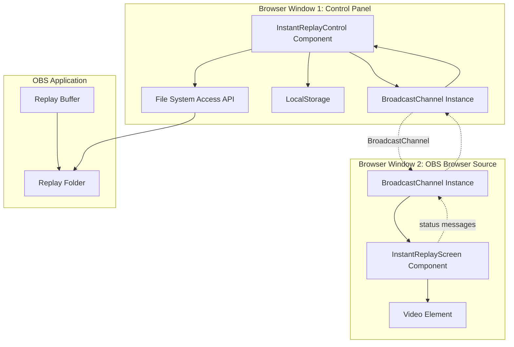
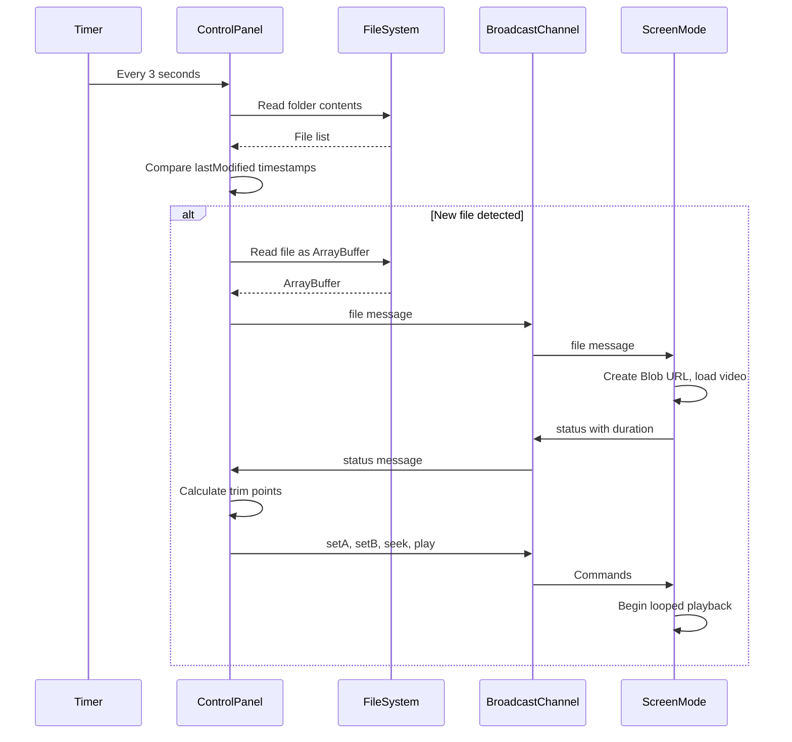

# Design Document: Instant Replay

## Overview

The Instant Replay system is a browser-based video playback solution integrated into a React application for managing OBS Replay Buffer clips during live football streaming broadcasts. The system architecture follows a dual-view pattern with a control panel and a screen display component communicating via the BroadcastChannel API.

### Key Design Principles

1. **Separation of Concerns**: Control logic is isolated in the Control Panel while playback rendering is handled by Screen Mode
2. **Real-time Communication**: BroadcastChannel API enables low-latency messaging between browser contexts
3. **File System Integration**: Modern File System Access API provides direct folder monitoring capabilities
4. **Stateless Communication**: Screen Mode receives all necessary state via messages, requiring no shared state storage
5. **Progressive Enhancement**: Falls back to manual file selection when File System Access API is unavailable

### System Context

The Instant Replay system operates within an existing React scoreboard application that:
- Uses React Router for route management
- Implements Firebase-based authentication with AuthGuard components
- Leverages OBS WebSocket integration for broadcast control
- Runs in a browser environment with OBS Browser Source

## Architecture

### Component Architecture



### Data Flow

**File Loading Flow:**
1. User triggers "Load Latest Replay" or auto-load detects new file
2. Control Panel reads file via File System Access API as ArrayBuffer
3. ArrayBuffer sent via BroadcastChannel with MIME type and filename
4. Screen Mode creates Blob URL from ArrayBuffer
5. Screen Mode loads video and extracts metadata
6. Screen Mode sends duration and status back to Control Panel
7. Control Panel calculates trim points if auto-trim is enabled
8. Control Panel sends seek and marker commands
9. Screen Mode begins looped playback

**Auto-Load Polling Flow:**


### Communication Protocol

**Message Types:**

```typescript
type FileMessage = {
  type: 'file';
  data: ArrayBuffer;
  mime: string;
  name: string;
};

type CommandMessage = {
  type: 'cmd';
  action: 'play' | 'pause' | 'seek' | 'setA' | 'setB' | 'clearLoop';
  value?: number;
};

type StatusMessage = {
  type: 'status';
  duration: number;
  currentTime: number;
  markerA: number | null;
  markerB: number | null;
};

type ChannelMessage = FileMessage | CommandMessage | StatusMessage;
```

**Channel Name:** `"scoreboard_replay_v1"`

## Components and Interfaces

### 1. InstantReplayControl Component

**Responsibilities:**
- Folder selection and file system access
- File loading and transmission
- Auto-trim calculation
- Auto-load polling
- Settings persistence
- UI rendering for operator

**State Management:**

```typescript
interface ControlState {
  // File system state
  folderHandle: FileSystemDirectoryHandle | null;
  videoFiles: File[];
  loadedFileName: string;
  
  // Video state (mirrored from screen)
  duration: number;
  currentTime: number;
  markerA: number | null;
  markerB: number | null;
  
  // Settings
  replayDuration: number;  // Default: 8
  autoTrim: boolean;       // Default: true
  autoLoad: boolean;       // Default: false
  
  // UI state
  folderName: string;
  lastScanTimestamp: number;
}
```

**Key Methods:**

```typescript
// File system operations
async selectFolder(): Promise<void>
async loadLatestFile(): Promise<void>
async scanFolderForNewFiles(): Promise<File[]>
async readFileAsArrayBuffer(file: File): Promise<ArrayBuffer>

// Communication
sendFileMessage(data: ArrayBuffer, mime: string, name: string): void
sendCommand(action: string, value?: number): void

// Auto-trim logic
calculateTrimStartTime(duration: number, replayDuration: number): number
applyAutoTrim(duration: number): void

// Polling
startPolling(): void
stopPolling(): void

// Persistence
saveSettings(): void
loadSettings(): void
```

### 2. InstantReplayScreen Component

**Responsibilities:**
- Video rendering
- Loop playback enforcement
- Command execution
- Status reporting

**State Management:**

```typescript
interface ScreenState {
  // Video element
  videoRef: RefObject<HTMLVideoElement>;
  objectUrl: string | null;
  hasVideo: boolean;
  
  // Loop markers
  loopA: number | null;
  loopB: number | null;
}
```

**Key Methods:**

```typescript
// Message handling
handleFileMessage(data: ArrayBuffer, mime: string): void
handleCommandMessage(action: string, value?: number): void

// Video control
playVideo(): Promise<void>
pauseVideo(): void
seekVideo(time: number): void

// Loop enforcement
checkLoopBoundaries(currentTime: number): void

// Status reporting
sendStatusMessage(): void

// Cleanup
revokeObjectUrl(): void
```

### 3. useReplayChannel Hook

**Purpose:** Encapsulate BroadcastChannel lifecycle and messaging

```typescript
interface ReplayChannelHook {
  channelRef: RefObject<BroadcastChannel>;
  send: (message: ChannelMessage) => void;
}

function useReplayChannel(): ReplayChannelHook {
  const channelRef = useRef<BroadcastChannel | null>(null);
  
  useEffect(() => {
    const channel = new BroadcastChannel('scoreboard_replay_v1');
    channelRef.current = channel;
    return () => {
      channel.close();
      channelRef.current = null;
    };
  }, []);
  
  const send = useCallback((message: ChannelMessage) => {
    channelRef.current?.postMessage(message);
  }, []);
  
  return { channelRef, send };
}
```

### 4. Utility Functions

```typescript
// Time formatting (MM:SS)
function formatTime(seconds: number): string;

// File size formatting (KB/MB)
function formatSize(bytes: number): string;

// Video file validation
function isVideoFile(file: File): boolean;

// Timestamp comparison for latest file detection
function findLatestFile(files: File[]): File | null;
```

## Data Models

### File Metadata

```typescript
interface VideoFileMetadata {
  name: string;
  size: number;           // bytes
  lastModified: number;   // Unix timestamp (milliseconds)
  type: string;           // MIME type
}
```

### Video State

```typescript
interface VideoState {
  duration: number;       // seconds
  currentTime: number;    // seconds
  markerA: number | null; // seconds, loop start
  markerB: number | null; // seconds, loop end
  isPlaying: boolean;
}
```

### Settings Schema

```typescript
interface ReplaySettings {
  replayDuration: number;  // seconds (3-30)
  autoTrim: boolean;
  autoLoad: boolean;
  folderName: string;      // Display name only (handle cannot be persisted)
}
```

**LocalStorage Keys:**
- `replayDuration`: number (default: 8)
- `autoTrim`: boolean (default: true)
- `autoLoad`: boolean (default: false)
- `replayFolderName`: string (default: "")

### Channel Message Schemas

**File Message:**
```typescript
{
  type: 'file',
  data: ArrayBuffer,      // Video file contents
  mime: string,           // e.g., "video/mp4"
  name: string            // Filename for display
}
```

**Command Message:**
```typescript
{
  type: 'cmd',
  action: 'play' | 'pause' | 'seek' | 'setA' | 'setB' | 'clearLoop',
  value?: number          // Required for seek, setA, setB
}
```

**Status Message:**
```typescript
{
  type: 'status',
  duration: number,       // Total video duration
  currentTime: number,    // Current playback position
  markerA: number | null, // Loop start marker
  markerB: number | null  // Loop end marker
}
```

## Error Handling

### File System Errors

**Error:** User cancels folder picker
- **Handling:** Silent catch, no UI feedback (expected user action)
- **Recovery:** User can retry folder selection

**Error:** Permission denied for folder access
- **Handling:** Log error, display user-friendly message
- **Recovery:** Prompt user to grant permissions or select different folder

**Error:** File read failure (file locked, deleted, or corrupted)
- **Handling:** Display error notification with filename
- **Recovery:** User can manually select different file or retry

**Error:** File System Access API not supported
- **Handling:** Fall back to hidden file input with `webkitdirectory` attribute
- **Recovery:** System operates with manual folder selection

### Communication Errors

**Error:** BroadcastChannel message send fails
- **Handling:** Silent catch in send method (optional chaining prevents crash)
- **Recovery:** Automatic retry on next user action

**Error:** Screen Mode not open when command sent
- **Handling:** Messages are queued by browser, no explicit handling needed
- **Recovery:** Screen Mode processes messages upon opening

**Error:** Invalid message format received
- **Handling:** Type guards validate message structure, ignore malformed messages
- **Recovery:** No action required, system continues operating

### Video Playback Errors

**Error:** Video element fails to load Blob URL
- **Handling:** Log error, display "Failed to load video" message
- **Recovery:** User can retry loading file

**Error:** Video play() promise rejected (autoplay policy)
- **Handling:** Silent catch with `.catch(() => undefined)`
- **Recovery:** User can manually click play button

**Error:** Invalid MIME type
- **Handling:** Browser attempts to play anyway, falls back to generic "video/mp4"
- **Recovery:** User can try different file

**Error:** Video duration is NaN or Infinity
- **Handling:** Guard checks prevent calculations, display duration as "0:00"
- **Recovery:** Automatic when valid video loads

### Polling Errors

**Error:** Folder access lost during polling
- **Handling:** Log error, continue polling (permission might be restored)
- **Recovery:** User re-selects folder if needed

**Error:** File system read timeout
- **Handling:** Skip current poll cycle, continue with next interval
- **Recovery:** Automatic on next successful poll

### LocalStorage Errors

**Error:** LocalStorage quota exceeded
- **Handling:** Log warning, continue with in-memory state only
- **Recovery:** Settings work for current session but won't persist

**Error:** LocalStorage disabled or blocked
- **Handling:** Use default values without attempting to persist
- **Recovery:** User must reconfigure each session

**Error:** JSON parse failure on stored value
- **Handling:** Fall back to default value for that setting
- **Recovery:** Automatic with defaults

## Testing Strategy

### Unit Testing Approach

**Test Framework:** Vitest (standard for Vite projects)

**Coverage Goals:**
- Utility functions: 100% coverage
- State management logic: 90% coverage
- UI interactions: 80% coverage

**Key Test Areas:**

1. **Utility Functions**
   - `formatTime`: Test edge cases (0, negative, NaN, Infinity, large values)
   - `formatSize`: Test byte ranges (0, 1023 bytes, 1KB, 1MB boundaries)
   - `isVideoFile`: Test MIME types and file extensions (including case variations)

2. **Auto-Trim Calculation**
   - Calculate trim start time for various durations and replay lengths
   - Boundary conditions (replay duration > video duration)
   - Edge cases (zero duration, fractional seconds)

3. **File Sorting**
   - Sort files by lastModified in descending order
   - Verify latest file selection logic
   - Handle files with identical timestamps

4. **Message Handling**
   - Verify correct message type discrimination
   - Test command execution (play, pause, seek, setA, setB, clearLoop)
   - Validate status message parsing

5. **Loop Enforcement**
   - Verify loop boundary checking (currentTime > markerB)
   - Verify backward seek enforcement (currentTime < markerA)
   - Test loop behavior with null markers

6. **LocalStorage Persistence**
   - Test save and restore for each setting
   - Test default value fallback when key missing
   - Test JSON parse error handling

### Integration Testing

**Test Scenarios:**

1. **End-to-End File Loading**
   - Mock File System Access API
   - Simulate folder selection
   - Verify file list population
   - Confirm ArrayBuffer transmission via mocked BroadcastChannel

2. **Auto-Load Workflow**
   - Mock polling timer
   - Simulate new file appearing
   - Verify automatic loading and trim application
   - Confirm play command sent

3. **Trim Calculation and Playback**
   - Load video with known duration
   - Enable auto-trim with specific duration
   - Verify setA, setB, seek commands sent with correct values
   - Confirm screen mode receives and applies markers

4. **Loop Playback**
   - Set markers on video
   - Simulate time updates
   - Verify seek commands when boundaries exceeded

### Manual Testing Checklist

**Setup:**
- [ ] Install OBS with Replay Buffer configured
- [ ] Add OBS Browser Source pointing to `/replay/screen`
- [ ] Open Control Panel at `/replay` in separate browser window

**Folder Selection:**
- [ ] Click "Select Replay Folder" and choose OBS replay directory
- [ ] Verify folder name displays
- [ ] Verify video files listed if any exist
- [ ] Refresh page and confirm folder name persists (LocalStorage)

**Manual Loading:**
- [ ] Click "Load Latest Replay"
- [ ] Verify video appears in OBS Browser Source
- [ ] Verify filename and metadata display in control panel
- [ ] Verify auto-trim applies if enabled
- [ ] Verify video loops in trimmed section

**Auto-Trim Settings:**
- [ ] Toggle auto-trim checkbox off
- [ ] Load video and verify full duration plays
- [ ] Toggle auto-trim on
- [ ] Select each preset button (5s, 8s, 10s, 15s, Full)
- [ ] Adjust slider and verify trim marker updates
- [ ] Verify "Playing from X to Y" message updates

**Auto-Load:**
- [ ] Enable "Auto-load new replays"
- [ ] Trigger OBS Replay Buffer save
- [ ] Within 3 seconds, verify new clip loads automatically
- [ ] Verify auto-trim applies if enabled
- [ ] Verify video begins playing immediately
- [ ] Trigger multiple replays in sequence and verify each loads

**Settings Persistence:**
- [ ] Configure all settings (duration, auto-trim, auto-load)
- [ ] Refresh page
- [ ] Verify all settings restored except folder handle

**Error Cases:**
- [ ] Deny folder permission and verify error message
- [ ] Load corrupted video file and verify error handling
- [ ] Close Screen Mode window and verify control panel doesn't crash
- [ ] Disable LocalStorage and verify graceful degradation

### Browser Compatibility Testing

**Target Browsers:**
- Chrome/Edge 86+ (File System Access API support)
- Firefox (fallback to file input)
- Safari (fallback to file input)

**Test Matrix:**
- [ ] Folder selection works or falls back appropriately
- [ ] BroadcastChannel communication functions
- [ ] Video playback and loop enforcement
- [ ] LocalStorage persistence
- [ ] UI renders correctly

## Implementation Notes

### File System Access API Considerations

The File System Access API is only available in Chromium-based browsers (Chrome, Edge) and requires user permission. The system provides a fallback mechanism:

1. **Primary Method:** `window.showDirectoryPicker()` for full folder access
2. **Fallback Method:** Hidden `<input type="file" webkitdirectory>` for browsers without API support

**Limitations:**
- Folder handle cannot be persisted (security restriction)
- User must re-grant folder access each session
- Fallback method has different UX (requires clicking twice)

### BroadcastChannel Reliability

BroadcastChannel provides reliable same-origin messaging but has limitations:

1. **Message Delivery:** Not guaranteed if receiver not listening at send time
2. **Message Order:** Guaranteed to be preserved
3. **Size Limits:** Browser-dependent (typically 1-5 MB for ArrayBuffer)

**Mitigation:**
- Screen Mode should be opened before loading large files
- Status messages provide state synchronization
- Large video files handled via ArrayBuffer transfer

### Performance Considerations

**File Scanning:**
- Polling every 3 seconds is acceptable for typical use cases (1-10 files)
- For folders with 100+ files, consider lazy loading or pagination

**ArrayBuffer Transfer:**
- Typical replay buffer files: 50-200 MB (30-60 seconds at 1080p)
- BroadcastChannel handles large ArrayBuffers efficiently
- Blob URL creation is near-instant

**Memory Management:**
- Only one video loaded at a time
- Previous Blob URL revoked before creating new one
- Video element cleaned up on component unmount

**Loop Enforcement:**
- `timeupdate` event fires 4-15 times per second during playback
- Loop check is O(1) with simple comparisons
- No performance concerns

### Auto-Trim Algorithm

```typescript
function calculateTrimStartTime(duration: number, replayDuration: number): number {
  // If replay duration exceeds video duration, play from start
  if (replayDuration >= duration) {
    return 0;
  }
  
  // Calculate start time as (total duration - desired replay length)
  return duration - replayDuration;
}
```

**Example:**
- Video duration: 35 seconds
- Replay duration setting: 8 seconds
- Trim start time: 35 - 8 = 27 seconds
- Playback: Loop from 27s to 35s

### Route Configuration

**App.tsx Integration:**

```typescript
import InstantReplayPage from './components/InstantReplayPage';
import AuthGuard from './components/AuthGuard';

// In router configuration:
<Route path="/replay" element={<AuthGuard><InstantReplayPage mode="control" /></AuthGuard>} />
<Route path="/replay/screen" element={<InstantReplayPage mode="screen" />} />
```

**Authentication:**
- Control Panel requires Firebase authentication
- Screen Mode is public for OBS Browser Source access

### Component File Structure

```
src/
  components/
    InstantReplayPage.tsx       # Main component (control + screen modes)
    InstantReplayPage.css       # Styles for both modes
  hooks/
    useReplayChannel.ts         # BroadcastChannel hook
  utils/
    replayFormatters.ts         # formatTime, formatSize utilities
    videoFileValidator.ts       # isVideoFile validation
```

### CSS Styling Requirements

The component should follow the existing VAR Replay styling patterns visible in `VarReplayPage.css`:

1. **Control Panel:** Professional broadcast control aesthetic with dark theme
2. **Screen Mode:** Full-screen video display with centered waiting message
3. **Responsive:** Adapt to different screen sizes
4. **OBS-Friendly:** High contrast, no transparency issues

### TypeScript Type Safety

All message types should use discriminated unions for type safety:

```typescript
// Type guards
function isFileMessage(msg: ChannelMessage): msg is FileMessage {
  return msg.type === 'file';
}

function isCommandMessage(msg: ChannelMessage): msg is CommandMessage {
  return msg.type === 'cmd';
}

function isStatusMessage(msg: ChannelMessage): msg is StatusMessage {
  return msg.type === 'status';
}

// Usage in message handlers
channel.onmessage = (event: MessageEvent<ChannelMessage>) => {
  const message = event.data;
  
  if (isFileMessage(message)) {
    // TypeScript knows message.data, message.mime, message.name exist
  } else if (isCommandMessage(message)) {
    // TypeScript knows message.action, message.value exist
  } else if (isStatusMessage(message)) {
    // TypeScript knows message.duration, message.currentTime, etc. exist
  }
};
```

## Correctness Properties

*A property is a characteristic or behavior that should hold true across all valid executions of a system—essentially, a formal statement about what the system should do. Properties serve as the bridge between human-readable specifications and machine-verifiable correctness guarantees.*

The Instant Replay system has limited applicability for comprehensive property-based testing because it is primarily a UI/video playback feature with heavy reliance on browser APIs (File System Access, BroadcastChannel, Video Element). However, there are several pure utility functions and core logic components that benefit from property-based testing.

### Property 1: File Sorting Preserves Order Invariant

*For any* array of video files with lastModified timestamps, when sorted by the Control Panel, the resulting array SHALL have files in descending order such that for all adjacent pairs (file[i], file[i+1]), file[i].lastModified >= file[i+1].lastModified.

**Validates: Requirements 1.3**

### Property 2: Trim Calculation Correctness

*For any* video duration D and replay duration R where both are positive numbers, when the Control Panel calculates trim start time, the result SHALL equal max(0, D - R), ensuring that trim start time is never negative and never exceeds the video duration.

**Validates: Requirements 3.5**

### Property 3: Time Formatting Round-Trip Structure

*For any* non-negative finite number of seconds S, when formatTime(S) is called, the output SHALL match the pattern `\d+:\d{2}` where minutes can be any non-negative integer and seconds are zero-padded to exactly 2 digits.

**Validates: Requirements 3.9, 8.5**

### Property 4: Size Formatting Consistency

*For any* non-negative byte value B, when formatSize(B) is called, the output SHALL be either in KB format (for B < 1,048,576) as `\d+ KB` or MB format (for B >= 1,048,576) as `\d+\.\d MB`, ensuring consistent unit selection based on magnitude.

**Validates: Requirements 8.2**

### Property 5: Video File Validation Completeness

*For any* file object F, when isVideoFile(F) is called, it SHALL return true if and only if F.type starts with "video/" OR F.name matches the pattern /\.(mp4|webm|mov|m4v|avi|mkv)$/i, ensuring comprehensive acceptance of valid video files through either MIME type or extension.

**Validates: Requirements 4.1, 4.2**

### Property 6: File Identification Consistency

*For any* collection of valid video files loaded into the Control Panel, when the file list is rescanned, the system SHALL identify the same set of video files in the same sorted order, ensuring stable file identification across multiple scans.

**Validates: Requirements 4.5**

### Property 7: New File Detection Accuracy

*For any* two sequential folder scans with file collections F1 and F2, when the Control Panel compares them, it SHALL identify file F as new if and only if F exists in F2 and either F does not exist in F1 or F.lastModified in F2 is strictly greater than F.lastModified in F1.

**Validates: Requirements 5.3**

### Property 8: Loop Boundary Enforcement

*For any* video playback state with markerA and markerB both set to non-null values where markerA < markerB, when currentTime is outside the range [markerA, markerB], the Screen Mode SHALL seek to markerA, ensuring continuous looped playback within the marked section.

**Validates: Requirements 7.1, 7.2, 7.3**

### Property 9: LocalStorage Persistence Round-Trip

*For any* valid setting value V (replayDuration as number 3-30, autoTrim as boolean, autoLoad as boolean, or folderName as string), when the Control Panel saves V to LocalStorage with the appropriate key and then reloads, it SHALL restore the same value V, ensuring settings persist correctly across sessions.

**Validates: Requirements 9.5, 9.6, 9.7, 9.8**
